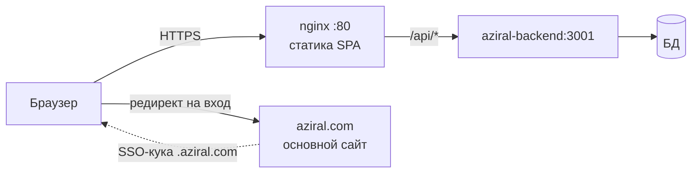

# Архитектура

Часть проекта [[learn-aziral]].

## Границы системы

Репозиторий отвечает **только за левую часть** — сборку SPA и его раздачу.
`aziral-backend` и БД — чужая зона ответственности, доступны по общей Docker-сети.

## Слои

| Слой | Путь | Роль |
|---|---|---|
| Точка входа | `src/main.tsx` | монтирование React, импорт i18n и стилей |
| Оболочка | `src/app/App.tsx` | роутер, провайдеры, `Suspense`, тосты |
| Состояние сессии | `src/app/contexts/AuthContext.tsx` | единственный глобальный контекст |
| Сеть | `src/api/client.ts` | все запросы к API |
| Страницы | `src/app/pages/*.tsx` | экраны, каждый lazy-загружается |
| Компоненты | `src/app/components/` | `Navbar`, `Logo`, `ErrorBoundary`, `LanguageSwitcher` |
| UI-примитивы | `src/app/components/ui/` | 48 обёрток над Radix (shadcn-стиль) |
| Утилиты | `src/utils/validation.ts` | правила валидации |
| Локали | `src/i18n/` | `ru.ts`, `en.ts`, `kz.ts` + детектор |

## Осознанные решения

**Глобальное состояние — только авторизация.**
Никаких Redux/Zustand. Данные страниц загружаются самими страницами в `useEffect`
и живут в локальном `useState`. Кэша между переходами нет — при возврате
на экран данные перезапрашиваются. Это упрощает код ценой лишних запросов.

**Разделение кода по страницам.**
Все 9 экранов обёрнуты в `lazy()` (`src/app/App.tsx:7-15`). Это заметно
влияет на первую загрузку: страницы крупные, `TestBuilderPage` — 1446 строк,
`InstructorPage` — 1529.

**Стилизация — Tailwind 4 через Vite-плагин**, без отдельного `tailwind.config`.
Классы пишутся прямо в разметке, включая произвольные значения (`bg-[#030712]`).

> [!note] Две цветовые темы в коде
> В приложении сосуществуют тёмная палитра (`#030712`, `violet-500` — оболочка,
> лоадеры, `Toaster theme="dark"`) и светлая «бумажная» (`#E8E5DF`, `#0047FF`,
> `#1A1A1A` — страницы тестов). Это следы редизайна раздела тестов
> (коммит `9a3131d`), а не системная тема. При правках учитывай, на каком экране
> находишься.

## Алиас импорта

`@` → `./src`, настроен и в `vite.config.ts`, и в `vitest.config.ts`, и в tsconfig.
