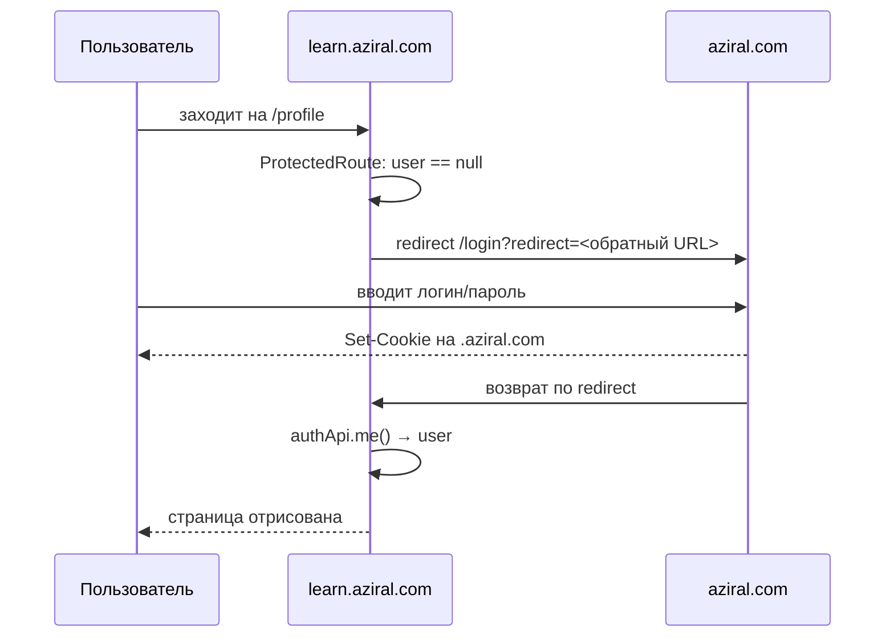

# Аутентификация SSO

Часть проекта [[learn-aziral]].

## Принцип

Форм входа и регистрации в этом приложении **нет**. Вход происходит на основном
сайте `aziral.com`, который ставит куку на домен `.aziral.com` — она автоматически
видна поддомену `learn.aziral.com`.

`src/app/pages/LoginPage.tsx` (14 строк) и `RegisterPage.tsx` (12 строк) —
это заглушки-редиректы, а не экраны.

## Поток входа



## Ключевые места в коде

**`src/app/contexts/AuthContext.tsx`** — единственный источник правды о сессии.
При монтировании вызывает `authApi.me()`; успех → `user`, любая ошибка → `null`.

Тип пользователя:
```ts
type User = {
  id: number; name: string; email: string;
  role: 'user' | 'instructor' | 'admin';
  username?, avatar?, bio?, notifications_enabled?
}
```

> [!important] Токена на клиенте нет by design
> В контексте есть поле `token: null` с комментарием
> `// cookie-based, no token exposed in client` (`AuthContext.tsx:19`).
> Кука HttpOnly — JS её не читает. Никакого `localStorage` с сессией.

**`ProtectedRoute`** (`src/app/App.tsx:37-54`):
1. `loading` → показать спиннер;
2. нет `user` → жёсткий `window.location.href` на `aziral.com/login` с обратным URL;
3. `requireRole` не совпал → `Navigate` на `/profile`, при этом **`admin` проходит везде**.

## Обработка бана

Нестандартный, но рабочий приём: `src/api/client.ts:22-24` при `403` с текстом
`"Аккаунт заблокирован"` бросает DOM-событие `azr:banned`. `AuthContext` слушает
его (`AuthContext.tsx:46-50`) и мгновенно сбрасывает пользователя в `null` —
это выкидывает его из защищённых маршрутов без перезагрузки.

## Выход

`logout()` — оптимистичный: сначала локально чистит `user`, потом дёргает
`POST /auth/logout` (ошибку глотает) и уводит на `aziral.com`.

## Проверка ролей — только UX

`requireRole` на фронте прячет интерфейс, но не защищает данные.
Показательный коммит `100124b`: с маршрута `/instructor/tests/:id/build`
роль **сняли намеренно**, оставив комментарий в `App.tsx:77` —
*«тесты доступны всем залогиненным, backend проверяет ownership»*.

> [!warning] Правило
> Любое ограничение доступа обязано дублироваться на бэкенде.
> Фронтовые роли — это удобство, а не граница безопасности.

Связано: [[API клиент]], [[Роутинг и страницы]].
